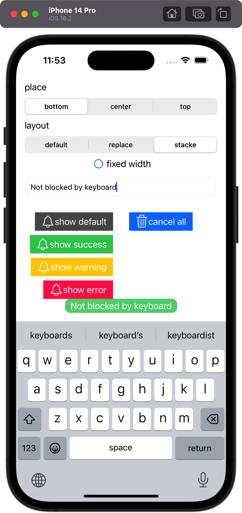
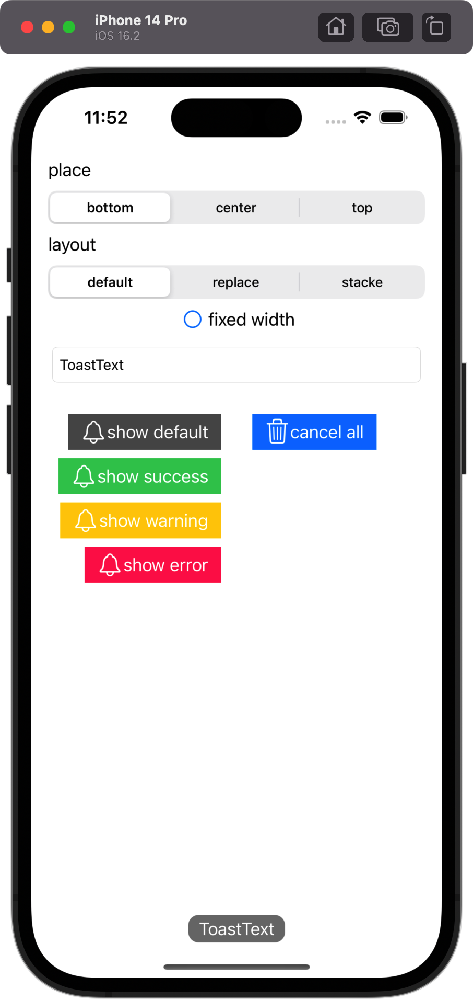
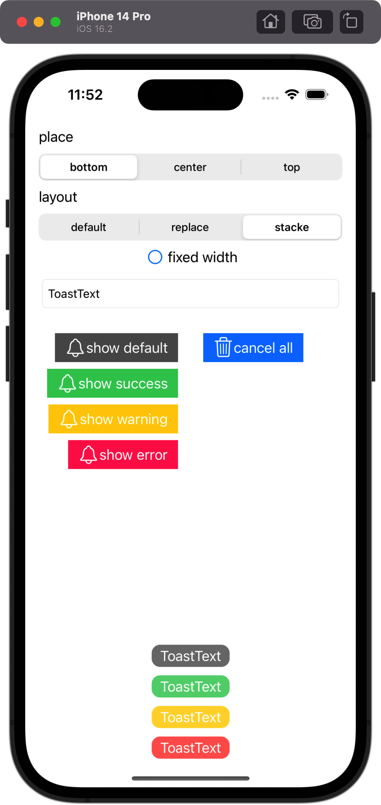
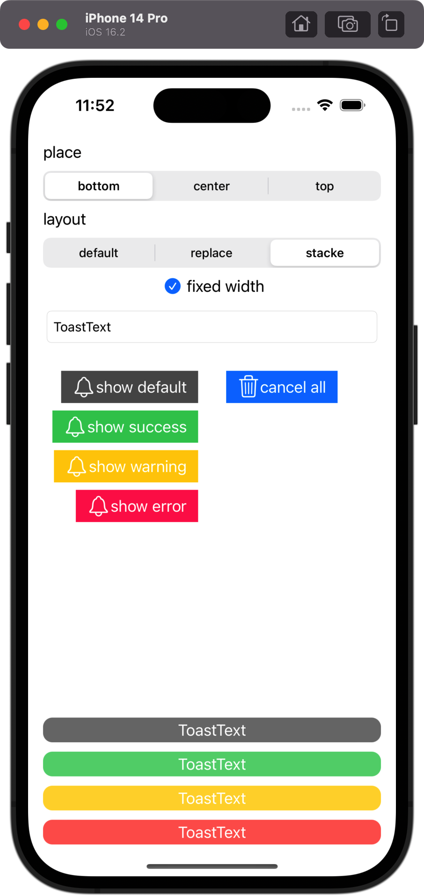
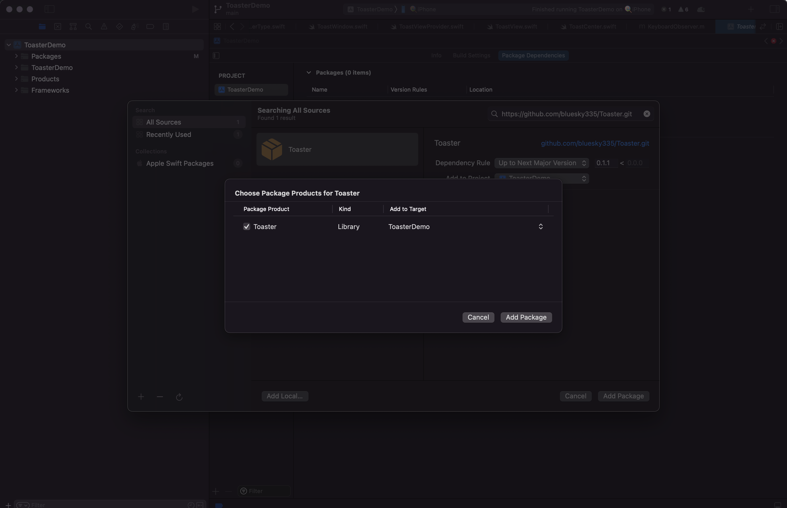
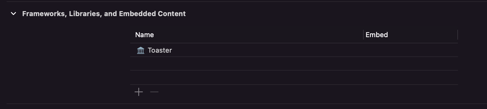

# 🍞 Toaster
A toaster library for iOS written in Swift.

## Feature

  - 🤖 Android-like Toast.
  - 📦 Ready-to-use right out of the box.
  - ✂️ Easy to customize.
  - 🐦 Swift package manager supported.
  - ⌨️ Not blocked by the keyboard.
  - 🍎 iOS 11 or newer is support.
  
## Screen record

https://user-images.githubusercontent.com/13523898/228002374-1222a236-1dc7-4c7d-b30b-6d82935a066d.MP4

## Screenshot

> 
> 
> 
> 


## Usage

### install
To integrate Toaster into your Xcode project using Swift Package Manager, add it to the dependencies value of your **Package.swift**:
``` swift
dependencies: [
    .package(url: "https://github.com/bluesky335/Toaster.git", .upToNextMajor(from: "0.2.0"))
]
```
or using Xcode swift package manager:


then add 'Toaster' in to 'Frameworks,Libraries,and Embedded Content':


### using in code

```
Toast(text:"🍞 o(￣▽￣)ｄ ").show()
```

## How to customized

### simple customize

``` swift
// customize toast style
Toast.successStyle = .init(backgroundColor: .systemGreen.withAlphaComponent(0.8))
Toast.errorStyle = .init(backgroundColor: .systemRed.withAlphaComponent(0.8))
Toast.warningStyle = .init(backgroundColor: .systemYellow.withAlphaComponent(0.8))
Toast.defaultStyle = .init()
// customize toast position layout or fixedWidth
ToastCenter.default.toastAnimator = ToastAnimatter(position: .top, layout: .stack, fixedWidth: true)
```

### full customize

- implement you own **ToastType**
  
  > Optional step, you can use the default implementation: `Toast`

    ``` swift

    public struct MyToast: ToastType {
        public var duration: ToastDuration
        public var content: String
    }

    ```
- implement a ToastViewProviderType for your **ToastType**
  ``` swift
  public final class MyToastViewProvider: ToastViewProviderType<MyToast> {
    @MainActor override public func viewForToast(toast: MyToast) -> UIView {
        let view = UIView()
        /*
        .... 
        Create a view and set it via the "toast" parameter.
        This view will be displayed by toast center.
        ....
        */
        return view
    }
  }
  ```

- register your ToastViewProviderType into toast center
  ``` swift 
  // If this type of toast is already registered, this will replace it.
  ToastCenter.default.register(toastType: MyToast.self, with: MyToastViewProvider())
  ```

- show your toast
  ``` seift
  MyToast(duration:.short, content: "toast text").show()
  ```
you can also customize the toast animation by implement your own ToastAnimatterType and set it to `ToastCenter.default.toastAnimator` replacing the default [ToastAnimatter](./Sources/Toaster/ToastAnimatter.swift).

### multiple scene support

`ToastCenter.default` display the toast view in the first UIWindowScene connected to the app.
you can creat ToastCenter for diffrent window scenes by `ToastCenter(windowScene: scene)`.